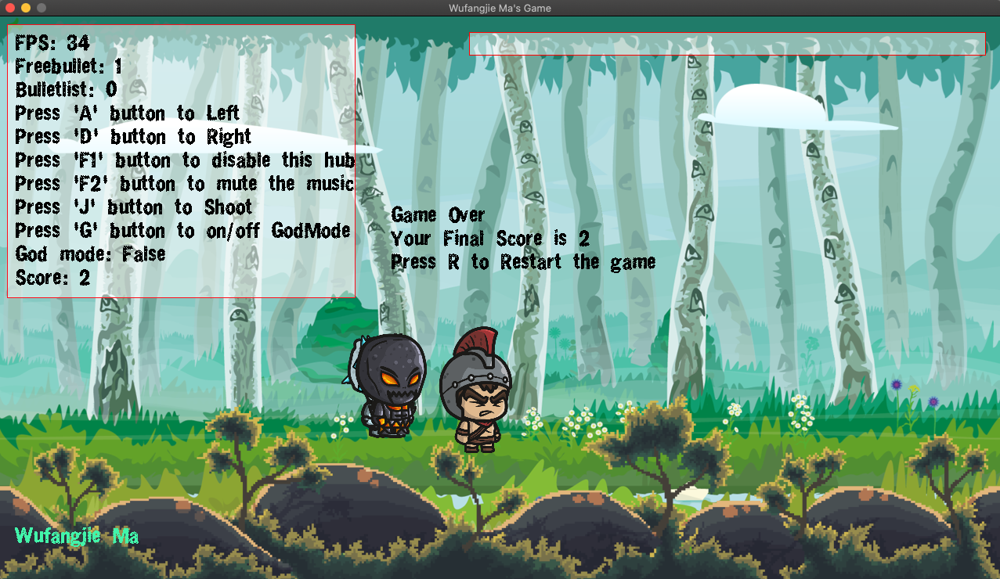

# 2D Game Engine Development

### In this project, I use the basic 2D game engine provided by  [Dr. Malloy](https://people.cs.clemson.edu/~malloy/courses/4160-2019/index.html) to develop a 2D game, where this game engine mainly use C++ 11 and SDL2 library.

##  Game Mechanics:

### In this game, we will play the role of a knight to kill all the zombie we meet with. Our knight will shoot a fire ball to kill the knight.

### Note that: The reason for attacking by throwing fireballs instead of using weapons is purely because of the requirement of the course, and the professor requires the function of throwing something.

### There has two ways to finish this game, you can kill all the zombie you meet with or get killed, where the game will judge you victory if you kill all the zombies, whereas you will lose when you run out of your blood hub. Whenever zombies attack you, your health will be reduced.

## Game Control:

+ Press **A & D** key to go left and right
+ Press **J key** to shoot one fireball, where hold it will do the function of continuous throwing
+ Press **G key** to turn on/off god mode, where in the god mode our character will not take damage
+ Press **Q key** to quit the game
+ Press **R key** to restart the game.
+ Press **F1 key** to enable/disable the information hub
+ Press **F2 key** to mute/unmute the background music

### Dead Screenshot

### Knowledge agenda:

+ **Singleton Design Pattern**
+ **Observer Pattern**
+ **Animation**
+ **Polymorphic and Inherit**
+ **Object Pool (Shooting)**
+ **Music and Sound**
+ **Blood Hub**
+ **UML Class Diagram**

## Source:

+ Zombie 1 and 2 : https://craftpix.net/freebies/free-golems-chibi-2d-game-sprites/
+ Knight: https://craftpix.net/product/spartan-knight-and-warrior-chibi-2d-game-sprites/
+ Ground background: https://craftpix.net/product/pixel-art-forest-2d-backgrounds/
+ Cloud background: https://craftpix.net/product/2d-mountain-backgrounds/
+ Forest background: https://craftpix.net/product/forest-2d-game-backgrounds/
