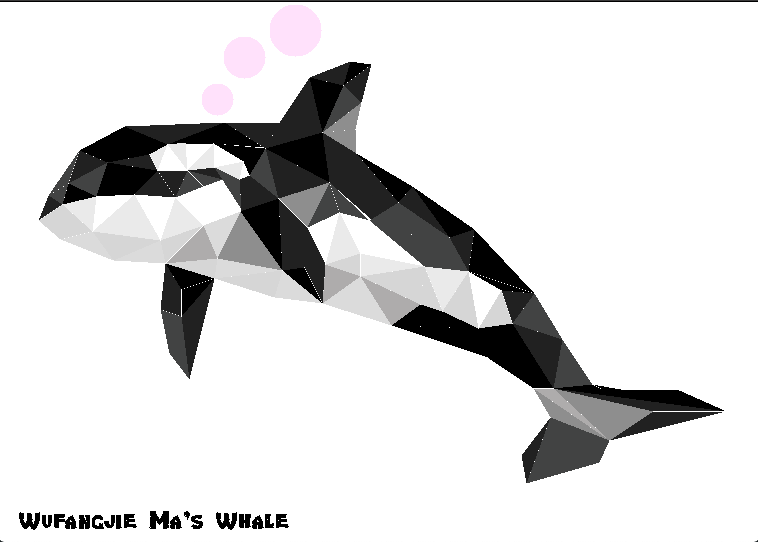

# Project description:

In my project, I basically use two shapes to draw my picture: triangle and circle. Whale is drawn form different triangles and bubble drawn from circles. Specifically, I use "vector2f.cpp" to build a two dimensional vector and use this structure to draw triangle.

   In addition, I use "draw_filled_triangle.cpp" to achieve drawing triangle and "draw_filled_circle.cpp" to achieve drawing circle. In the file of  "draw_a_Whale.cpp", it call the aforementioned functions to draw my picture ---Whale.
  
  
# Result
 

